# NSCA 外骨骼系统 v1.0 开发路线图

> **文档定位**：外骨骼系统（Spring Cloud Alibaba 微服务平台外壳）的独立工程实施计划
> **核心策略**：先企业设施后平台体验 / 网关即集成协议 / 与核心业务完全并行
> **版本**：v1.0 | 日期：2026-04-28
> **目标读者**：平台工程师、DevOps、技术负责人

---

## 1. 执行摘要

外骨骼系统的开发遵循**"先设施后体验 → 先认证后计费 → 先隔离后开放"**的渐进式交付路径。每一阶段交付一个**独立可用的平台能力**。外骨骼与核心业务系统（`services/`）完全并行开发，唯一集成面是网关 HTTP Header 协议。

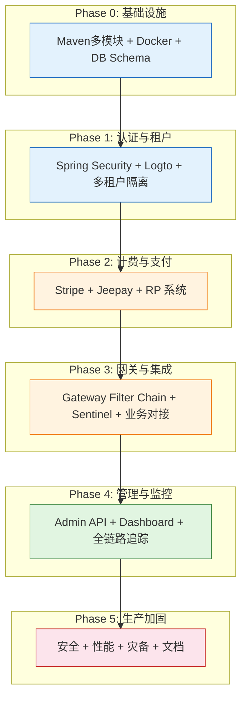

**阶段颜色说明**：
- 🔵 蓝色阶段：基础设施，无用户可见功能，但所有后续阶段依赖
- 🟠 橙色阶段：核心业务能力，用户可直接感知（登录/支付）
- 🟢 绿色阶段：运维可见，平台运营能力
- 🔴 红色阶段：生产就绪，安全与可靠性

**与核心业务的关键差异**：

| 维度 | 外骨骼系统 | 核心业务系统 |
|------|-----------|------------|
| 技术栈 | Spring Boot 3.4 + Cloud Alibaba | Python FastAPI / 任意语言 |
| 数据库 | PostgreSQL（独立实例） | 无用户表，信任 Header |
| 交付节奏 | Phase 0-1 需优先完成（认证是前提） | 可使用 Mock 认证并行开发 |
| 集成面 | 网关是唯一入口 | 接收 X-Tenant-Id / X-User-Id Header |

---

## 2. 总体策略

### 2.1 风险前置矩阵

| 风险项 | 风险等级 | 缓解阶段 | 缓解措施 |
|--------|---------|---------|---------|
| Logto OIDC 集成失败 | 🔴 极高 | Phase 1 | 提前验证 JWT 签发/校验全链路，准备 Keycloak 备用方案 |
| MyBatis-Plus 租户拦截器遗漏 | 🔴 极高 | Phase 1 | 全局 SQL 日志审计，集成测试覆盖每张表 |
| Stripe/Jeepay Webhook 签名校验 | 🔴 极高 | Phase 2 | 使用官方 SDK 验证方法，不手写签名逻辑 |
| RP 余额并发扣除超卖 | 🔴 极高 | Phase 2 | PostgreSQL 行级锁 + @Transactional，压测验证 |
| 网关 Filter 顺序错误导致鉴权绕过 | 🔴 极高 | Phase 3 | Filter 顺序写死为 ordinal 常量，集成测试覆盖所有顺序组合 |
| Sentinel 规则误拦正常流量 | 🟠 高 | Phase 3 | 先在日志模式运行 1 周，确认无误再开启限流 |
| Jeepay 支付宝/微信回调延迟 | 🟠 高 | Phase 2 | 异步重试队列 + 手动补单后台 |
| Nacos 单点故障 | 🟡 中 | Phase 5 | 开发阶段可单机，Phase 5 升级集群模式 |

### 2.2 高度并行模型

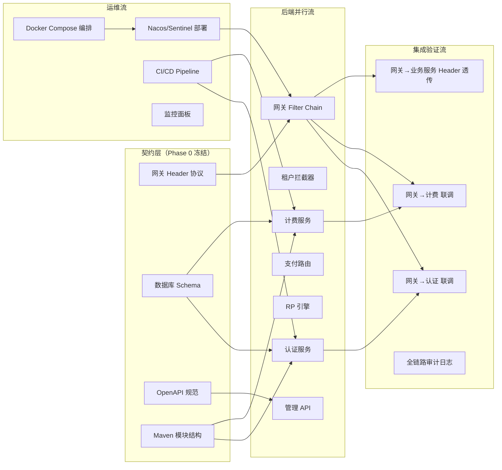

**并行原则**：
1. **契约先行**：网关 Header 协议（X-Tenant-Id / X-User-Id / X-Job-Id / X-Features）在 Phase 0 冻结
2. **核心业务不等待**：核心引擎开发使用 Mock 认证（`X-User-Id: mock-user-1`），不依赖外骨骼就绪
3. **支付沙箱优先**：Stripe Test Mode + Jeepay 沙箱环境在 Phase 0 即配置好
4. **每个服务独立可测**：认证/计费/网关各自有独立测试套件，不交叉依赖

### 2.3 与核心业务的集成节奏

```
外骨骼 Phase 1 完成（认证就绪）
  → 核心业务可从 Mock 认证切换为真实 JWT 认证
  → 只需信任 X-User-Id / X-Tenant-Id Header
  → 核心代码零修改

外骨骼 Phase 2 完成（计费就绪）
  → 核心 API 调用开始消耗 RP
  → 网关自动完成 RP 扣除
  → 核心代码零修改

外骨骼 Phase 3 完成（网关就绪）
  → 所有流量经过网关 Filter Chain
  → 限流/熔断/审计全部生效
  → 核心代码零修改
```

---

## 3. 阶段详细计划

### Phase 0: 基础设施与契约冻结（第 1-2 周）

**目标**：搭建 Maven 多模块项目骨架、Docker Compose 开发环境、数据库 Schema、冻结网关 Header 协议。

**交付物**：

| 交付物 | 模块 | 验收标准 |
|--------|------|---------|
| Maven 多模块项目 | `exoskeleton/` | `mvn clean compile` 全部模块通过 |
| Docker Compose 开发环境 | `exoskeleton/docker-compose.yml` | `docker compose up -d` 启动 PostgreSQL + Redis + Nacos + Logto |
| 数据库 Schema v0 | Flyway 迁移脚本 | 全部 9 张表（tenants/users/plans/subscriptions/rp_transactions/api_keys/tenant_configs/audit_logs/webhook_events）可迁移/回滚 |
| 网关 Header 协议文档 | `05-gateway-integration.md` | 6 个 Header 定义冻结，与核心业务团队确认 |
| CI/CD Pipeline | GitHub Actions | 自动编译 + 测试 + 代码检查 |
| `exoskeleton-common` 模块 | AuthContext / AuthContextHolder / 基础异常类 | 所有模块可依赖 |

**并行工作流**：

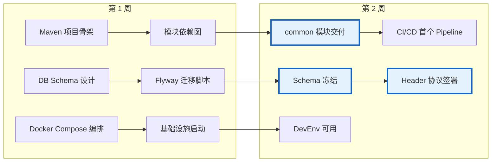

**风险缓解**：
- 第 1 周末：Maven 模块间无循环依赖，所有模块能独立编译
- 第 2 周：Header 协议与核心业务团队联合评审，双方签字确认
- Docker Compose 必须能在 macOS 和 Linux 上同时启动

**升级路径**：Phase 0 完成后，认证/计费/网关可以并行启动开发。

---

### Phase 1: 认证与多租户（第 3-6 周）

**目标**：完成用户注册/登录/认证全流程、多租户数据隔离、API Key 管理。这是外骨骼最核心的能力。

**交付物**：

| 交付物 | 模块 | 验收标准 |
|--------|------|---------|
| Spring Security OAuth2 配置 | `exoskeleton-auth` | JWT 签名/过期/issuer 校验通过，角色提取正确 |
| Logto OIDC 集成 | `exoskeleton-auth` | 注册/登录/Token 刷新全流程可用 |
| 用户 JIT 预创建 | `exoskeleton-tenant` | 首次 API 请求自动创建用户，幂等 |
| AuthContext / AuthContextHolder | `exoskeleton-common` | ThreadLocal 正确设置/清除，无内存泄漏 |
| MyBatis-Plus 租户拦截器 | `exoskeleton-tenant` | 全部 SQL 自动追加 `WHERE tenant_id = ?` |
| 租户入驻流程 | `exoskeleton-tenant` | Super Admin 创建租户 → 自动创建 Logto 租户 + 管理员 |
| API Key CRUD | `exoskeleton-auth` | 创建/查看前缀/撤销/使用统计 |
| 认证上下文 Filter | `exoskeleton-gateway` | JWT 校验通过后正确注入 X-User-Id, X-Tenant-Id |

**并行工作流**：

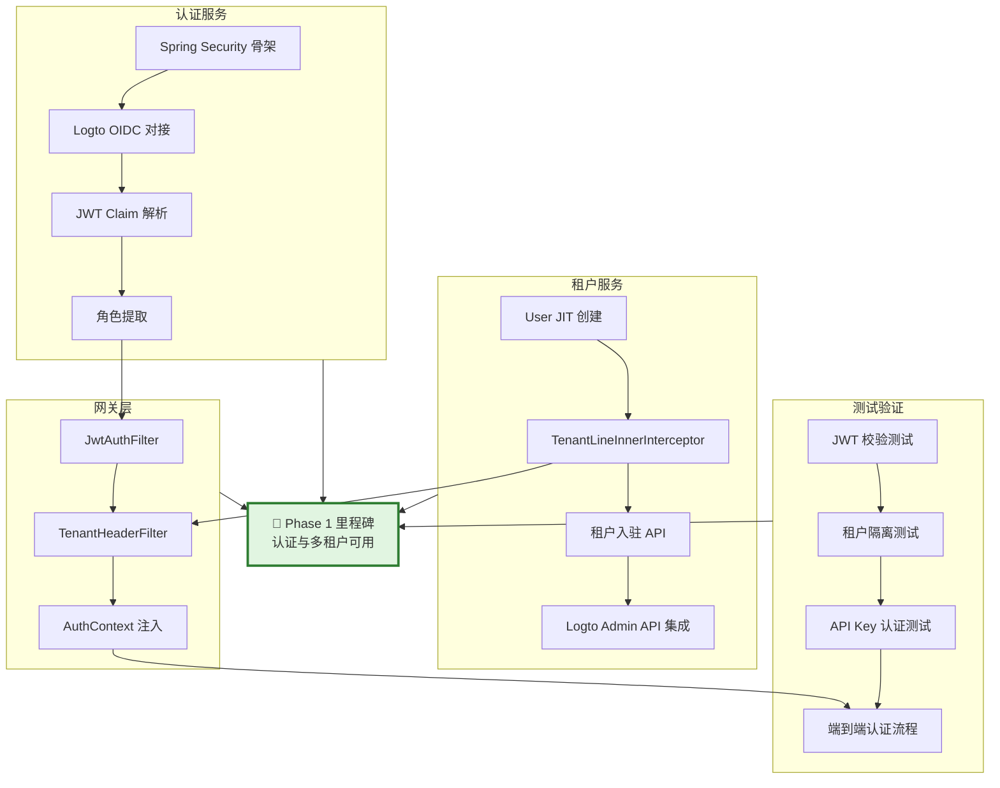

**关键路径**：Spring Security 配置 → Logto 集成 → JWT 校验 → 租户拦截器 → 端到端认证

**风险缓解**：
- **Week 3**：优先验证 Logto JWT 签发和 Spring Security 校验的密钥配对，这是最易出错的环节
- **Week 4**：租户拦截器接入 SQL 日志，人工抽查全部 SQL 是否包含 `WHERE tenant_id`
- **Week 5-6**：API Key 的 bcrypt 哈希比对性能测试，确保不影响请求延迟

**阶段交付形态**：
- 用户可注册/登录（邮箱 + GitHub OAuth + Google OAuth）
- 每个用户属于一个租户，所有数据自动隔离
- API Key 可用于 CLI/SDK 访问
- 网关向业务服务正确注入 X-User-Id 和 X-Tenant-Id

**升级开关**：`auth.enabled=true`（默认），关闭后进入无认证模式（仅开发环境）。

---

### Phase 2: 计费与支付（第 7-12 周）

**目标**：完成订阅计划、Stripe + Jeepay 支付集成、RP 积分系统的完整闭环。

**交付物**：

| 交付物 | 模块 | 验收标准 |
|--------|------|---------|
| 统一支付抽象 (PaymentService) | `exoskeleton-billing` | StripePaymentService / JeepayPaymentService 实现同一接口 |
| Stripe 集成 | `exoskeleton-billing` | PaymentIntent 创建 → 3DS 认证 → Webhook 回调 → 订阅状态更新 |
| Jeepay 集成 | `exoskeleton-billing` | 支付宝/微信支付 → 回调验签 → 订单状态更新 |
| 支付策略路由 (PaymentRouter) | `exoskeleton-billing` | 根据支付方式 + 币种自动选择 Stripe 或 Jeepay |
| Webhook 幂等处理 | `exoskeleton-billing` | event_id 唯一约束，重复事件返回 `already_processed` |
| RP 服务 (@Transactional) | `exoskeleton-billing` | 余额不足抛异常回滚，并发扣除无超卖 |
| 订阅状态机 | `exoskeleton-billing` | active/past_due/cancelled/expired/trialing 完整流转 |
| XXL-JOB 定时任务 | `exoskeleton-scheduler` | 月度 RP 发放 + 余额过期检查 + Webhook 重试 |
| RP 消费网关过滤器 | `exoskeleton-gateway` | 按 API 路径自动扣除 RP，余额不足返回 402 |
| 功能门控过滤器 | `exoskeleton-gateway` | 检查套餐 features JSONB，不满足返回 403 |

**并行工作流**：

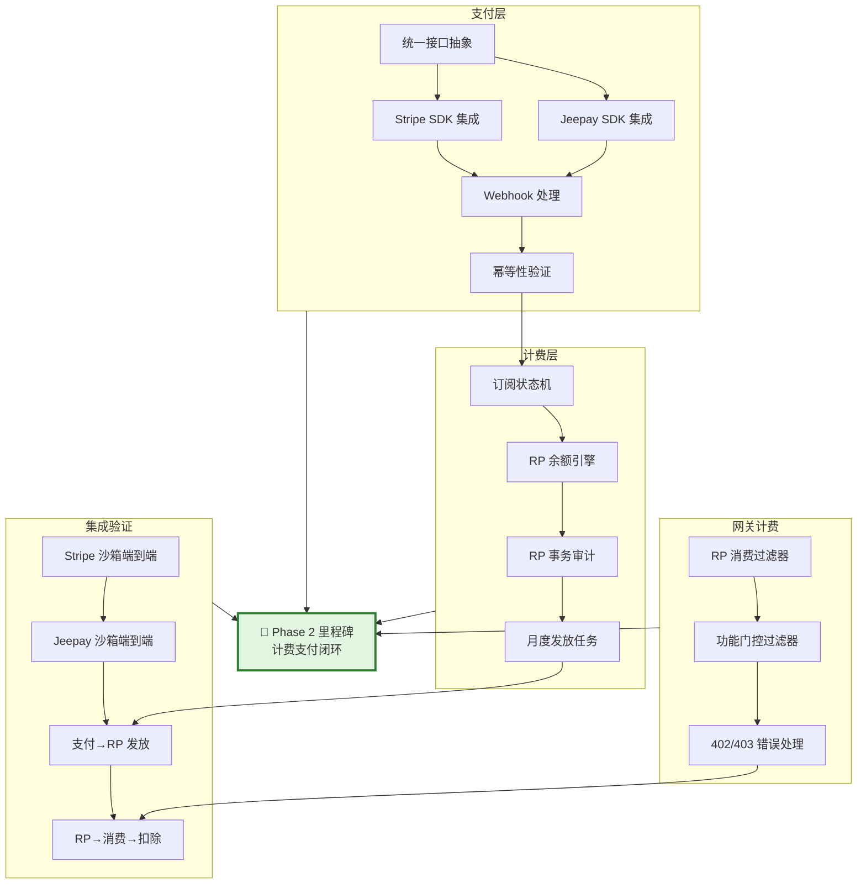

**关键路径**：支付抽象 → Stripe 集成 → Webhook 处理 → RP 引擎 → 网关消费过滤器

**风险缓解**：
- **Week 7-8**：优先完成 Stripe Test Mode 的 PaymentIntent → Webhook 全流程，这是国际支付的主路径
- **Week 9-10**：Jeepay 沙箱环境需要中国服务器 IP 白名单，提前申请
- **Week 11**：RP 余额并发扣除用 JMeter 压测 1000 并发，验证 `@Transactional` + 行级锁无超卖
- **Week 12**：XXL-JOB 的任务幂等性验证——同一任务重复执行不重复发放 RP

**阶段交付形态**：
- 用户可选择订阅计划并完成支付（国际信用卡 / 支付宝 / 微信）
- 每月自动发放 RP 配额
- API 调用时网关自动扣除 RP
- 支付 Webhook 事件完整处理，支付状态实时更新

---

### Phase 3: 网关与集成协议（第 13-16 周）

**目标**：完成 Spring Cloud Gateway 完整 Filter Chain、Sentinel 限流熔断、Resilience4j 断路器、业务服务集成验证。

**交付物**：

| 交付物 | 模块 | 验收标准 |
|--------|------|---------|
| 路由配置 | `exoskeleton-gateway` | 外骨骼内部路由 + 业务服务路由全部正确 |
| 完整 Filter Chain | `exoskeleton-gateway` | 7 个 Filter 按序执行，顺序不可变 |
| Sentinel 限流规则 | `exoskeleton-gateway` | 租户级/用户级/全局级限流生效 |
| Resilience4j 断路器 | `exoskeleton-gateway` | 业务服务故障时正确熔断，半开恢复 |
| 审计日志 Filter | `exoskeleton-gateway` | 异步记录，不阻塞主流程 |
| Header 透传验证 | `exoskeleton-gateway` | X-User-Id/X-Tenant-Id/X-Request-Id/X-Features 正确到达业务服务 |
| Nacos 服务注册 | 全部模块 | 所有微服务在 Nacos 注册，健康检查通过 |
| SkyWalking 链路追踪 | 全部模块 | 跨服务调用链完整可见 |

**并行工作流**：

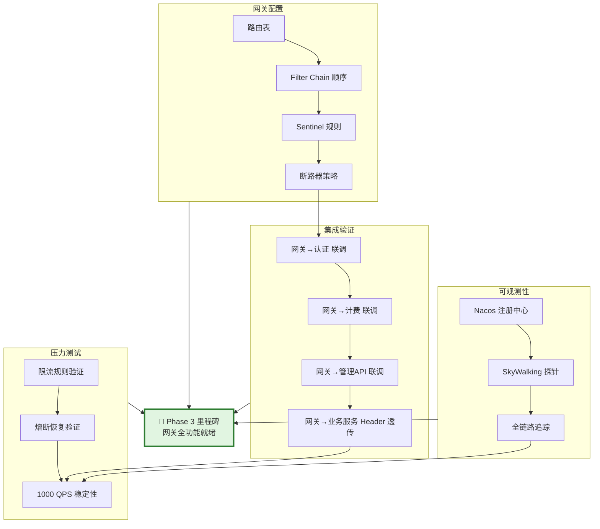

**关键路径**：路由配置 → Filter Chain 顺序 → Sentinel 规则 → 业务服务集成 → 压力测试

**风险缓解**：
- **Week 13**：Filter Chain 顺序是最关键的设计——顺序错误可能导致鉴权绕过。写死 ordinal 常量（-1, 0, 10, 20, 30, 40, 50, 99）
- **Week 14-15**：Sentinel 规则先在日志模式运行 1 周，确认无误后再开启限流
- **Week 16**：业务服务 Header 透传测试——核心业务团队确认 X-Tenant-Id / X-User-Id 正确接收

**阶段交付形态**：
- 所有 API 请求经过完整的 Filter Chain（认证 → 租户 → 功能门控 → RP 扣除 → 限流 → 路由 → 审计）
- 业务服务故障时自动熔断，恢复后自动半开
- Nacos Dashboard 可见全部微服务健康状态
- SkyWalking 可追踪跨服务调用链

---

### Phase 4: 管理控制台与运维（第 17-20 周）

**目标**：完成管理 API、监控面板、运维工具，平台运营能力就绪。

**交付物**：

| 交付物 | 模块 | 验收标准 |
|--------|------|---------|
| 管理 REST API | `exoskeleton-admin` | 租户/用户/订阅/RP/审计 CRUD 全部可用 |
| RBAC 权限控制 | `exoskeleton-admin` | Super Admin / Tenant Admin / Support 三角色正确隔离 |
| 管理控制台前端骨架 | `admin/` | 登录 + 仪表板 + 租户列表 + 用户列表页面 |
| Prometheus + Grafana | 监控栈 | 微服务指标采集 + 仪表板 |
| Sentinel Dashboard | 限流管理 | 规则实时查看/修改 |
| XXL-JOB Dashboard | 调度管理 | 任务状态/日志/手动触发 |
| 告警规则 | Prometheus AlertManager | 服务宕机 / RP 异常消耗 / Webhook 失败率告警 |

**并行工作流**：

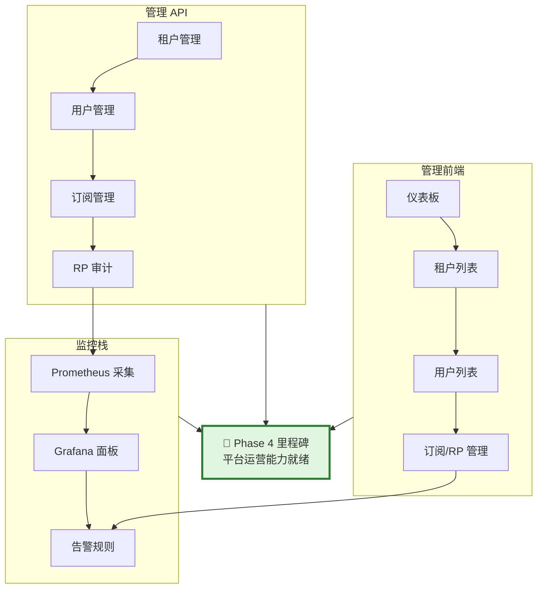

**风险缓解**：
- **Week 17-18**：管理 API 的权限控制必须严格——Super Admin 可操作所有租户，Tenant Admin 只能操作自己租户
- **Week 19-20**：Grafana 面板至少包含：API QPS、P99 延迟、RP 消费速率、Webhook 成功率

**阶段交付形态**：
- 管理员可通过 Web 界面管理租户/用户/订阅
- Grafana 展示全平台实时运营指标
- 异常情况自动告警

---

### Phase 5: 生产加固（第 21-24 周）

**目标**：安全审计、性能优化、灾备方案、文档完善。系统达到生产就绪标准。

**交付物**：

| 交付物 | 模块 | 验收标准 |
|--------|------|---------|
| 安全审计 | 全部 | OWASP Top 10 扫描通过，无 CRITICAL 漏洞 |
| 性能优化 | 全部 | 网关 P99 < 50ms（不含业务调用），RP 扣除 P99 < 10ms |
| Nacos 集群 | 基础设施 | 3 节点集群 + MySQL 持久化 |
| PostgreSQL 主从 | 基础设施 | 读写分离 + 自动故障切换 |
| Redis Sentinel | 基础设施 | 哨兵模式 + 自动故障转移 |
| 灾备演练 | 全部 | 数据库恢复 < 30 分钟，服务自愈 < 5 分钟 |
| API 文档 | 全部 | OpenAPI 3.0 规范，Swagger UI 可访问 |
| 运维手册 | 全部 | 部署/监控/告警/故障处理完整文档 |

**并行工作流**：

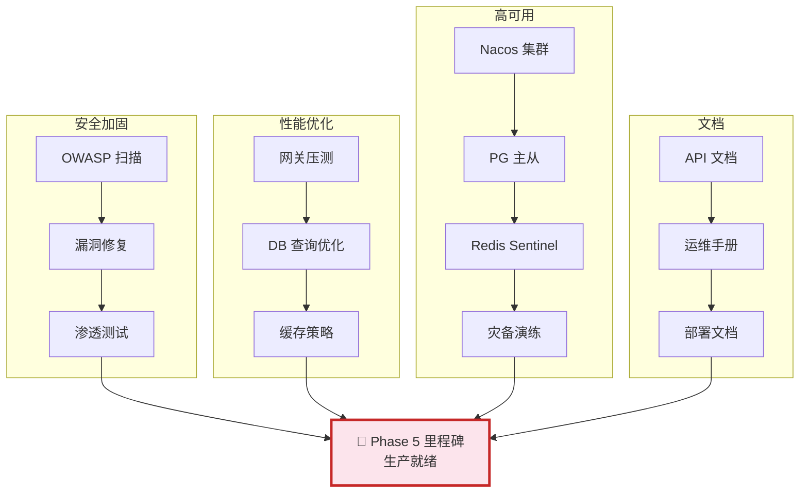

**风险缓解**：
- **Week 21-22**：安全审计发现 CRITICAL 漏洞必须立即修复，HIGH 漏洞必须在 Phase 5 结束前关闭
- **Week 23**：灾备演练必须实际执行一次完整恢复流程，不允许"理论可行"
- **Week 24**：运维手册必须包含"常见故障处理"章节，覆盖至少 10 个故障场景

**阶段交付形态**：
- 系统可在生产环境稳定运行
- 安全扫描通过，高可用架构就绪
- 运维文档完整，新人可按手册独立部署

---

## 4. 全局依赖与甘特图

### 4.1 服务依赖图

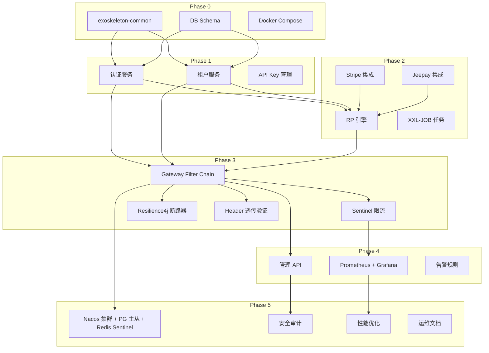

### 4.2 甘特图

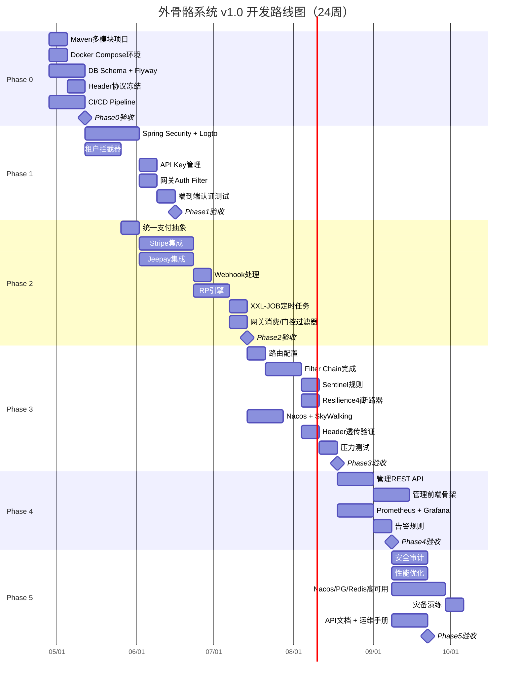

---

## 5. 团队与执行

### 5.1 团队分工

| 角色 | 人数 | 负责模块 | 活跃阶段 |
|------|------|---------|---------|
| **平台工程师 (认证)** | 1人 | Spring Security / Logto / API Key / AuthContext | Phase 0-3 |
| **平台工程师 (租户)** | 1人 | MyBatis-Plus / 租户隔离 / 用户 JIT | Phase 0-3 |
| **平台工程师 (计费)** | 1人 | Stripe / Jeepay / RP 引擎 / Webhook | Phase 2-4 |
| **平台工程师 (网关)** | 1人 | Gateway / Filter Chain / Sentinel / Resilience4j | Phase 3-4 |
| **DevOps** | 1人 | Docker / CI/CD / Nacos / SkyWalking / 高可用 | Phase 0, 5 |
| **前端工程师** | 1人 | 管理控制台前端 (React + Ant Design) | Phase 4 |

> 注：此团队可与核心业务团队共享人员，但两个系统独立开发、独立仓库、独立 CI/CD。

### 5.2 每周并行任务示例（Phase 2 第 1 周）

```mermaid
flowchart LR
    subgraph Mon["周一"]
        M1[认证工程师: 认证上下文传递到计费服务]
        M2[租户工程师: 租户表关联 users 表]
        M3[计费工程师: PaymentService 接口定义]
        M4[DevOps: Stripe Webhook 本地隧道配置]
    end

    subgraph Wed["周三"]
        W1[认证工程师: AuthContext Filter 调试]
        W2[租户工程师: ignoreTable 配置验证]
        W3[计费工程师: Stripe PaymentIntent 首次请求]
        W4[DevOps: Jeepay 沙箱环境申请]
    end

    subgraph Fri["周五"]
        F1[认证工程师: 集成测试编写]
        F2[租户工程师: 跨租户访问拦截测试]
        F3[计费工程师: Stripe SDK 错误处理]
        F4[DevOps: 本地 HTTPS 证书配置]
    end

    Mon --> Wed --> Fri

    style Mon fill:#e3f2fd,stroke:#1565c0
    style Wed fill:#fff3e0,stroke:#ef6c00
    style Fri fill:#e1f5e1,stroke:#2e7d32
```

---

## 6. 里程碑验收标准

### Milestone 1：认证与多租户可用（Phase 1 结束）

- [ ] Logto 注册/登录全流程可用（邮箱 + GitHub + Google）
- [ ] JWT 签发/校验/过期处理正确
- [ ] 租户拦截器对全部表（除 plans/webhook_events）注入 WHERE tenant_id
- [ ] API Key 创建/撤销/使用统计可用
- [ ] 网关向业务服务正确注入 X-User-Id, X-Tenant-Id
- [ ] 跨租户访问被正确拦截（403）

### Milestone 2：计费支付闭环（Phase 2 结束）

- [ ] Stripe Test Mode PaymentIntent → Webhook → 订阅激活全流程
- [ ] Jeepay 沙箱支付宝/微信支付 → 回调 → RP 到账
- [ ] 1000 并发 RP 扣除无超卖
- [ ] XXL-JOB 月度发放准确、不重复
- [ ] 网关 RP 消费过滤器正确扣除，余额不足返回 402
- [ ] 功能门控按套餐 features 正确拦截

### Milestone 3：网关全功能就绪（Phase 3 结束）

- [ ] 7 个 Filter 按序执行，无绕过
- [ ] Sentinel 限流规则生效，超限返回 429
- [ ] Resilience4j 断路器在业务服务故障时正确熔断
- [ ] 审计日志异步记录完整
- [ ] 1000 QPS 持续 10 分钟无 5xx 错误
- [ ] SkyWalking 链路追踪跨服务完整

### Milestone 4：平台运营能力就绪（Phase 4 结束）

- [ ] 管理 API 完整可用（租户/用户/订阅/RP CRUD）
- [ ] 管理控制台前端可登录 + 查看仪表板 + 管理租户
- [ ] Prometheus + Grafana 监控面板展示核心指标
- [ ] 服务宕机/Sentinel 限流触发告警通知

### Milestone 5：生产就绪（Phase 5 结束）

- [ ] OWASP Top 10 扫描无 CRITICAL 漏洞
- [ ] 网关 P99 < 50ms（不含业务调用）
- [ ] Nacos 集群 + PostgreSQL 主从 + Redis Sentinel 可用
- [ ] 灾备演练：数据库恢复 < 30 分钟，服务自愈 < 5 分钟
- [ ] API 文档 + 运维手册完整

---

## 7. 风险应急计划

### 7.1 红色风险应急预案

| 风险场景 | 触发条件 | 应急措施 | 影响 |
|---------|---------|---------|------|
| Logto OIDC 集成失败 | JWT 校验连续失败 | 切换为 Keycloak，1 周缓冲期 | Phase 1 延长 1 周 |
| 租户数据泄漏 | 跨租户查询返回非本租户数据 | 立即冻结网关，逐表审计 SQL 日志 | Phase 1 延长 2 周 |
| Stripe Webhook 签名校验失败 | 回调数据被篡改 | 回退到手动确认支付状态，联系 Stripe Support | Phase 2 延长 1 周 |
| RP 并发超卖 | 压测发现余额负数 | 引入 Redis 分布式锁 + DB 乐观锁双重保障 | Phase 2 延长 1 周 |
| Gateway Filter 顺序错误 | 鉴权绕过漏洞 | 立即回滚 Filter Chain 配置，编写 Filter 顺序集成测试 | Phase 3 延长 1 周 |
| 业务服务 Header 不兼容 | 核心业务无法读取 X-Tenant-Id | 网关临时添加 JSON Body 注入兼容模式 | 不影响外骨骼进度 |

### 7.2 范围收缩策略

若进度落后，按以下优先级收缩范围：

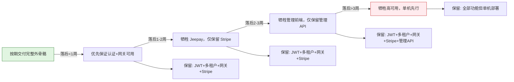

**核心原则**：认证和网关是整个外骨骼的脊梁，这两项绝对不能收缩。

---

## 8. 与核心业务的集成检验点

| 外骨骼阶段 | 检验内容 | 核心业务配合 |
|-----------|---------|------------|
| Phase 1 完成 | 核心业务能否通过 X-User-Id 识别用户 | 读取 Header 替代 Mock 认证 |
| Phase 2 完成 | 核心 API 调用是否正确触发 RP 扣除 | 确认 RP 扣除不阻塞业务响应 |
| Phase 3 完成 | 限流/熔断不影响正常业务调用 | 配合压力测试 |
| Phase 4 完成 | 管理后台可查看核心业务的审计日志 | audit_logs 表包含核心 API 记录 |

---

## 9. 成功度量

| 维度 | 指标 | 目标值 |
|------|------|--------|
| **安全** | OWASP 漏洞数 | 0 CRITICAL, 0 HIGH |
| **性能** | 网关 P99 延迟 | < 50ms |
| **性能** | RP 扣除 P99 延迟 | < 10ms |
| **可靠性** | 网关可用性 | 99.9% |
| **隔离** | 跨租户数据泄漏 | 0 次 |
| **支付** | Webhook 处理成功率 | > 99.5% |
| **审计** | 审计日志完整性 | 100% |

---

**文档结束。**

> **使用说明**：本文档是外骨骼系统的独立工程路线图，与核心业务路线图（`docs/core/planning/development-roadmap.md`）完全并行。两个系统通过网关 Header 协议集成，互不阻塞。甘特图日期基于 2026-04-28 起算。
